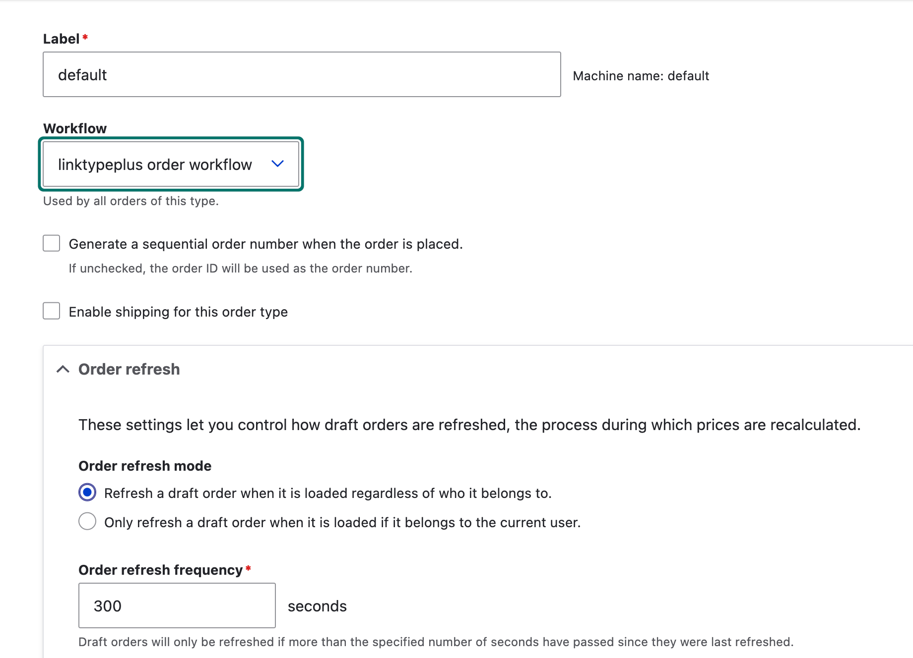

# Commerce GMO LinkTypePlus

Commerce GMO linktypeplus is a module that will make use of the linktype plus payment in the drupal commerce.

For a more details and documentation, please visit https://docs.mul-pay.jp/linkplus/overview

## Table of contents

- Requirements
- Installation
- Configuration
- Maintainers

## Requirements

No additional requirements

## Installation

Install as you would normally install a contributed Drupal module. For further
information, see
[Installing Drupal Modules](https://www.drupal.org/docs/extending-drupal/installing-drupal-modules).

## Configuration

Configure the Linktypeplus payment gateway at (/admin/commerce/config/payment-gateways).

We created a custom payment workflow for this module. To select the workflow, go to: /admin/commerce/config/order-types and select the `linktypeplus order workflow`

## Maintainers

Current maintainers:

- [Muneeb Mukhtar](https://www.drupal.org/u/mukhtarm)
- [Nivetha Subramaniam](https://www.drupal.org/u/nivetha)

Supporting organizations:

- [Srijan](https://www.drupal.org/srijan-a-material-company) Created this module for you!
